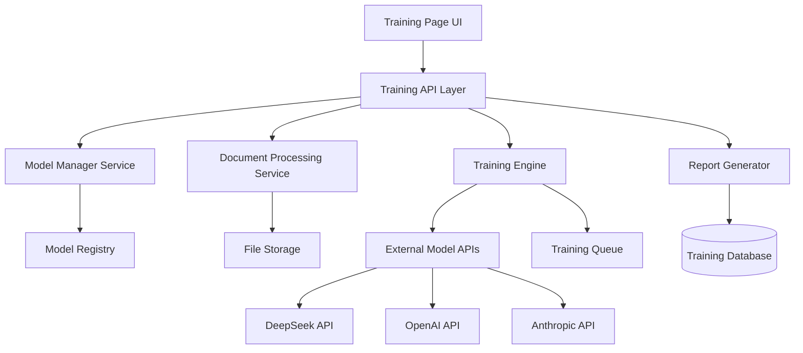

# Design Document

## Overview

The LLM Training Page is a web-based interface that enables users to fine-tune various LLM models (starting with DeepSeek) using custom documents. The system provides a complete workflow from model selection and document upload through training execution and comprehensive reporting.

## Architecture

### High-Level Architecture



### Component Breakdown

- **Training Page UI**: React-based frontend with real-time updates
- **Training API Layer**: RESTful API handling all training operations
- **Model Manager Service**: Handles model selection, configuration, and API integration
- **Document Processing Service**: Processes uploaded files and prepares training data
- **Training Engine**: Orchestrates fine-tuning operations with external APIs
- **Report Generator**: Creates comprehensive training reports and analytics

## Components and Interfaces

### Frontend Components

#### ModelSelector Component
```typescript
interface ModelSelectorProps {
  availableModels: LLMModel[];
  selectedModel: string;
  onModelChange: (modelId: string) => void;
}

interface LLMModel {
  id: string;
  name: string;
  provider: string;
  capabilities: string[];
  maxTokens: number;
  supportedFormats: string[];
}
```

#### DocumentUploader Component
```typescript
interface DocumentUploaderProps {
  onFilesUploaded: (files: UploadedFile[]) => void;
  acceptedFormats: string[];
  maxFileSize: number;
}

interface UploadedFile {
  id: string;
  name: string;
  size: number;
  type: string;
  content: string;
  uploadDate: Date;
}
```

#### TrainingConfiguration Component
```typescript
interface TrainingConfigProps {
  modelId: string;
  config: TrainingConfig;
  onConfigChange: (config: TrainingConfig) => void;
}

interface TrainingConfig {
  learningRate: number;
  batchSize: number;
  epochs: number;
  temperature?: number;
  maxTokens?: number;
  customParameters: Record<string, any>;
}
```

#### TrainingProgress Component
```typescript
interface TrainingProgressProps {
  sessionId: string;
  status: TrainingStatus;
  progress: TrainingProgress;
}

interface TrainingProgress {
  completionPercentage: number;
  currentEpoch: number;
  totalEpochs: number;
  loss: number;
  estimatedTimeRemaining: number;
  metrics: Record<string, number>;
}
```

### Backend Services

#### Training API Endpoints
```typescript
// Model Management
GET /api/models - List available models
GET /api/models/:id - Get model details
POST /api/models/:id/validate - Validate model configuration

// Document Management
POST /api/documents/upload - Upload training documents
GET /api/documents - List uploaded documents
DELETE /api/documents/:id - Delete document
POST /api/documents/datasets - Create document dataset

// Training Operations
POST /api/training/sessions - Start training session
GET /api/training/sessions/:id - Get training status
DELETE /api/training/sessions/:id - Cancel training
GET /api/training/sessions - List all sessions

// Reports
GET /api/reports/:sessionId - Get training report
GET /api/reports/compare - Compare multiple sessions
POST /api/reports/:sessionId/export - Export report
```

#### Model Manager Service
```typescript
interface ModelManagerService {
  getAvailableModels(): Promise<LLMModel[]>;
  validateConfiguration(modelId: string, config: TrainingConfig): Promise<ValidationResult>;
  initializeTraining(modelId: string, documents: string[], config: TrainingConfig): Promise<TrainingSession>;
}
```

#### Document Processing Service
```typescript
interface DocumentProcessorService {
  processUpload(file: File): Promise<ProcessedDocument>;
  extractText(file: File): Promise<string>;
  validateFormat(file: File): Promise<ValidationResult>;
  createDataset(documents: string[], name: string): Promise<Dataset>;
}
```

## Data Models

### Training Session Model
```typescript
interface TrainingSession {
  id: string;
  modelId: string;
  modelName: string;
  documents: string[];
  configuration: TrainingConfig;
  status: 'pending' | 'running' | 'completed' | 'failed' | 'cancelled';
  startTime: Date;
  endTime?: Date;
  progress: TrainingProgress;
  results?: TrainingResults;
  error?: string;
}
```

### Training Results Model
```typescript
interface TrainingResults {
  finalLoss: number;
  improvementMetrics: Record<string, number>;
  trainingDuration: number;
  tokensProcessed: number;
  modelPerformance: {
    beforeTraining: PerformanceMetrics;
    afterTraining: PerformanceMetrics;
  };
  sampleOutputs: {
    input: string;
    beforeOutput: string;
    afterOutput: string;
  }[];
}
```

### Document Model
```typescript
interface Document {
  id: string;
  name: string;
  originalName: string;
  size: number;
  type: string;
  content: string;
  metadata: {
    wordCount: number;
    language: string;
    uploadDate: Date;
    checksum: string;
  };
  datasets: string[];
}
```

## Error Handling

### Client-Side Error Handling
- Form validation with real-time feedback
- File upload error handling with specific error messages
- Network error recovery with retry mechanisms
- Training session error display with actionable suggestions

### Server-Side Error Handling
- API rate limiting and quota management
- Model API error handling and fallback strategies
- File processing error recovery
- Training session failure handling with detailed logging

### Error Types
```typescript
enum ErrorType {
  VALIDATION_ERROR = 'validation_error',
  UPLOAD_ERROR = 'upload_error',
  MODEL_ERROR = 'model_error',
  TRAINING_ERROR = 'training_error',
  API_ERROR = 'api_error',
  NETWORK_ERROR = 'network_error'
}

interface ErrorResponse {
  type: ErrorType;
  message: string;
  details?: Record<string, any>;
  suggestions?: string[];
}
```

## Testing Strategy

### Unit Testing
- Component testing with React Testing Library
- Service layer testing with Jest
- API endpoint testing with supertest
- Model integration testing with mock APIs

### Integration Testing
- End-to-end training workflow testing
- File upload and processing testing
- Real-time progress update testing
- Report generation testing

### Performance Testing
- Large file upload testing
- Concurrent training session testing
- API response time testing
- Memory usage monitoring during training

### Security Testing
- File upload security validation
- API authentication and authorization
- Input sanitization testing
- Rate limiting validation

## Implementation Considerations

### Model API Integration
- Support for multiple model providers (DeepSeek, OpenAI, Anthropic)
- Configurable API endpoints and authentication
- Rate limiting and quota management
- Error handling and retry logic

### File Processing
- Support for multiple file formats (PDF, TXT, DOCX, JSON)
- Text extraction and cleaning
- Content validation and preprocessing
- Chunking for large documents

### Real-time Updates
- WebSocket connection for training progress
- Server-sent events for status updates
- Graceful degradation for connection issues
- Progress persistence across page refreshes

### Scalability
- Asynchronous training processing
- Queue management for multiple sessions
- Database optimization for large datasets
- Caching strategies for frequently accessed data

### Security
- File upload validation and sanitization
- API key management and encryption
- User authentication and authorization
- Audit logging for training activities