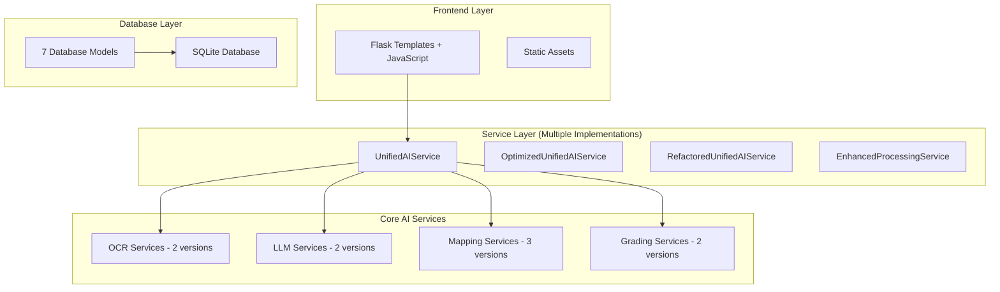

# Exam Grader - AI-Powered Assessment Platform

[](VERSION)
[](https://python.org)
[](https://flask.palletsprojects.com)
[](LICENSE)

A comprehensive Flask-based web application that uses AI to automatically grade exam submissions by comparing student answers against marking guides. The system supports OCR for handwritten submissions and uses advanced LLM technology for intelligent grading.

## 🚨 Current Status: Under Major Refactoring

**This codebase is currently undergoing comprehensive refactoring to address architectural redundancy and improve maintainability. See [CODEBASE_ANALYSIS.md](CODEBASE_ANALYSIS.md) for detailed analysis and [.kiro/specs/codebase-analysis-and-fixes/](/.kiro/specs/codebase-analysis-and-fixes/) for the improvement plan.**

## 🏗️ Architecture Overview



## 🚀 Quick Start

### Prerequisites

- Python 3.8 or higher
- Virtual environment (recommended)
- SQLite (included with Python)

### Installation

1. **Clone the repository**
   ```bash
   git clone <repository-url>
   cd exam-grader
   ```

2. **Set up virtual environment**
   ```bash
   python -m venv venv
   source venv/bin/activate  # On Windows: venv\Scripts\activate
   ```

3. **Install dependencies**
   ```bash
   pip install -r requirements.txt
   ```

4. **Configure environment variables**
   ```bash
   cp env.example .env
   # Edit .env with your API keys and configuration
   ```

5. **Run the application**
   ```bash
   python start.py
   ```

The application will be available at `http://127.0.0.1:8501`

## 🔧 Configuration

### Environment Variables

Create a `.env` file in the project root:

```env
# API Keys
HANDWRITING_OCR_API_KEY=your_ocr_api_key
DEEPSEEK_API_KEY=your_deepseek_api_key

# Database
DATABASE_URL=sqlite:///exam_grader.db

# Security
SECRET_KEY=your_secret_key_here
CSRF_ENABLED=True

# File Processing
MAX_FILE_SIZE_MB=20
SUPPORTED_FORMATS=.pdf,.docx,.doc,.jpg,.jpeg,.png,.bmp,.tiff,.gif

# Server
HOST=127.0.0.1
PORT=8501
DEBUG=True

# Logging
LOG_LEVEL=INFO
```

### API Keys Required

1. **HandwritingOCR API**: For processing handwritten submissions
   - Sign up at [HandwritingOCR](https://www.handwritingocr.com)
   - Get your API key from the dashboard

2. **DeepSeek API**: For LLM-powered grading
   - Sign up at [DeepSeek](https://platform.deepseek.com)
   - Get your API key from the console

## 📁 Project Structure

```
exam-grader/
├── src/                          # Core application code
│   ├── api/                      # API endpoints (4 different blueprints)
│   ├── config/                   # Configuration management
│   ├── database/                 # Database models and utilities
│   ├── parsing/                  # Document parsing utilities
│   ├── security/                 # Security and authentication
│   ├── services/                 # Business logic services (20+ services)
│   └── utils/                    # Utility functions
├── webapp/                       # Flask web application
│   ├── static/                   # Static assets (CSS, JS, images)
│   ├── templates/                # Jinja2 templates
│   ├── exam_grader_app.py        # Main Flask application (4000+ lines)
│   └── *.py                      # Additional route modules
├── tests/                        # Test suite
├── utils/                        # Shared utilities
├── temp/                         # Temporary file storage
├── output/                       # Generated output files
├── logs/                         # Application logs
└── instance/                     # Instance-specific files
```

## 🎯 Features

### Current Features

- **Multi-format Support**: PDF, Word documents, and images
- **OCR Processing**: Handwritten text extraction
- **AI Grading**: LLM-powered answer comparison
- **Progress Tracking**: Real-time processing updates
- **User Management**: Authentication and session handling
- **Results Export**: PDF and JSON report generation
- **Responsive UI**: Mobile-friendly interface

### Processing Pipeline

1. **Upload Marking Guide**: Define grading criteria
2. **Upload Submissions**: Student answer sheets
3. **OCR Processing**: Extract text from images
4. **Answer Mapping**: Match student answers to guide questions
5. **AI Grading**: Compare answers using LLM
6. **Results Generation**: Detailed feedback and scores

## 🔍 Known Issues & Limitations

### Architectural Issues

1. **Service Redundancy**: Multiple implementations of similar functionality
   - 4 different AI processing services
   - 2-3 versions of each core service (OCR, LLM, Mapping, Grading)

2. **API Fragmentation**: 40+ routes in main app + 4 separate API blueprints

3. **Frontend Limitations**: Template-based UI with limited real-time features

4. **Testing Gaps**: Incomplete test coverage for many components

### Performance Issues

1. **Redundant Processing**: Same data processed multiple times
2. **Inefficient Caching**: Inconsistent caching strategies
3. **API Call Optimization**: Unnecessary duplicate LLM calls

## 🛠️ Development

### Running Tests

```bash
# Run all tests
python -m pytest tests/

# Run specific test file
python -m pytest tests/test_services.py

# Run with coverage
python -m pytest --cov=src tests/
```

### Development Server

```bash
# Run the application (simple)
python start.py

# Run with advanced options
python run_app.py --debug --port 8080

# Check system requirements
python run_app.py --check
```

### Database Management

```bash
# Initialize database
python -c "from webapp.exam_grader_app import app, db; app.app_context().push(); db.create_all()"

# Reset database (WARNING: Deletes all data)
python reset_database.py
```

## 📊 Database Schema

The application uses SQLite with the following main models:

- **User**: Authentication and user management
- **MarkingGuide**: Grading criteria and questions
- **Submission**: Student submissions and processing status
- **Mapping**: Answer mapping between guides and submissions
- **GradingResult**: Individual grading results
- **Session**: Secure session management
- **GradingSession**: AI processing session tracking

See [src/database/models.py](src/database/models.py) for detailed schema.

## 🔒 Security Features

- **Authentication**: Flask-Login integration
- **Session Management**: Secure encrypted sessions
- **CSRF Protection**: Flask-WTF CSRF tokens
- **Input Validation**: Comprehensive input sanitization
- **File Security**: Type and size validation
- **Rate Limiting**: API abuse prevention (configurable)

## 📈 Performance Monitoring

### Health Check Endpoint

```bash
curl http://localhost:8501/api/health
```

### Cache Management

Access cache management at `/cache-management` (requires login)

### Logging

Logs are stored in the `logs/` directory:
- `app.log`: General application logs
- `exam_grader.log`: Specific grading operations

## 🚀 Deployment

### Production Setup

1. **Environment Configuration**
   ```bash
   export FLASK_ENV=production
   export DEBUG=False
   export SECRET_KEY=your_production_secret_key
   ```

2. **Database Migration**
   ```bash
   # Backup existing data
   cp instance/exam_grader.db instance/exam_grader.db.backup
   
   # Run migrations if needed
   python migrate_db.py
   ```

3. **WSGI Server**
   ```bash
   pip install gunicorn
   gunicorn -w 4 -b 0.0.0.0:8000 webapp.exam_grader_app:app
   ```

### Docker Deployment

```dockerfile
FROM python:3.9-slim
WORKDIR /app
COPY requirements.txt .
RUN pip install -r requirements.txt
COPY . .
EXPOSE 8501
CMD ["python", "run_app.py"]
```

## 🤝 Contributing

### Current Development Focus

The project is currently undergoing major refactoring. Priority areas:

1. **Service Consolidation**: Merge redundant service implementations
2. **API Standardization**: Create unified API structure
3. **Frontend Modernization**: Implement component-based UI
4. **Testing Enhancement**: Improve test coverage
5. **Documentation**: Update all documentation

### Development Guidelines

1. Follow existing code patterns until refactoring is complete
2. Add tests for any new functionality
3. Update documentation for changes
4. Use the existing configuration system

## 📚 Documentation

- [Codebase Analysis](CODEBASE_ANALYSIS.md) - Comprehensive analysis of current issues
- [Architecture Diagrams](ARCHITECTURE_DIAGRAMS.md) - Current vs. target architecture
- [Dependency Mapping](DEPENDENCY_MAPPING.md) - Service and component dependencies
- [Deployment Guide](DEPLOYMENT.md) - Production deployment instructions
- [API Documentation](API_DOCUMENTATION.md) - API endpoint reference
- [Frontend Guide](webapp/README.md) - Frontend development guide

## 🐛 Troubleshooting

### Common Issues

1. **Import Errors**: Ensure virtual environment is activated
2. **Database Errors**: Check database file permissions
3. **API Key Errors**: Verify API keys in `.env` file
4. **Port Conflicts**: Use `--port` flag to change port
5. **File Upload Issues**: Check file size and format restrictions

### Debug Mode

Run with debug logging:
```bash
LOG_LEVEL=DEBUG python start.py
```

### Manual QA Checklist

See [tests/manual_qa_checklist.md](tests/manual_qa_checklist.md) for comprehensive testing procedures.

## 📄 License

This project is licensed under the MIT License - see the [LICENSE](LICENSE) file for details.

## 🙏 Acknowledgments

- OpenAI for LLM integration patterns
- HandwritingOCR for OCR processing
- Flask community for web framework
- Contributors and testers

---

**Note**: This README reflects the current state of the codebase. For the planned improvements and refactoring roadmap, see the specification documents in [.kiro/specs/codebase-analysis-and-fixes/](/.kiro/specs/codebase-analysis-and-fixes/).